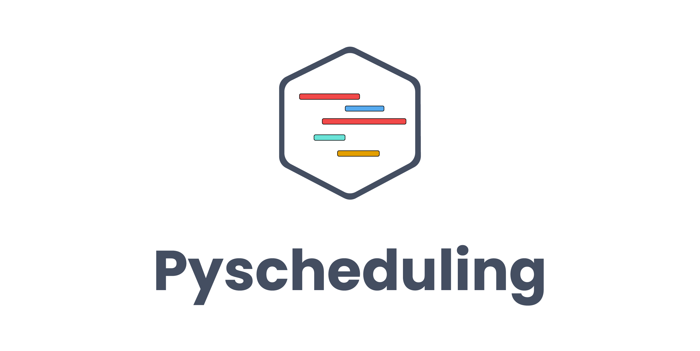

Pyscheduling is an open-source python package to solve **scheduling** problems. The categories tackled are : Single Machine, Parallel Machines, Flowshop and Jobshop. 

The infrastructure for each category is implemented and open to extension to accept problems with more specificity in terms of constraints and multi-objective opptimization. There are methods going from exact methods, heuristics, metaheuristics, B&B, ...etc to solve the different problems of the given category.

Single Machine Scheduling Problems :

* Minimize Total Weighted Lateness.
* Minimize Total Weighted Lateness with release dates.
* Minimize Total Weighted Lateness with sequence dependent setup time.
* Minimize Total Weighted Lateness with release dates and sequence dependent setup time.
* Minimize Maximal Lateness with release dates and precedence constraints.
* Minimize Total Weighted Completion Time.
* Minimize Total Weighted Completion Time with release dates.
* Minimize Maximal Completion Time with sequence dependent setup time.
* Minimize Maximal Completion Time with release dates and sequence dependent setup time.

Parallel Machine Scheduling Problems :

* Minimize Maximal Completion Time with sequence dependent setup time.
* Minimize Maximal Completion Time with release dates and sequence dependent setup time.

Flowshop :

* Minimize Maximal Completion Time.
* Minimize Maximal Completion Time with sequence dependent setup time.

Jobshop :

* Minimize Maximal Completion Time.

An easy-to-use interface is available for both single and parallel machines problems sheduling. In addition to both interfaces, a **benchmark** module is also available to allow it for users and especially researchers to test and benchmark their implemented methods based on our infrastructure with a given instances benchmark set.

The package is open to contribute for anyone in order to enrich the categories infrastructure, to implement state-of-the-art methods and to tackle more constrained problems.