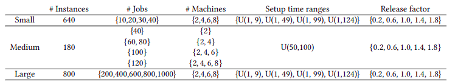

In order to study the unrelated parallel machine scheduling problem with release dates and setup times we generated a new benchmark of **1620 instances**, divided into three sets (Small, Medium and Large instances). 

This benchmark was first introduced in the paper "Efficient heuristics and metaheuristics for the unrelated parallel machine scheduling problem with release dates and setup times" published in [GECCO 2022, Boston.](https://gecco-2022.sigevo.org/) You can find the generation protocol details in the paper [here](https://dl.acm.org/doi/10.1145/3512290.3528857).

The following Table  shows the summary of the benchmark. 

You can download the instances from [here](https://drive.google.com/file/d/1cm-jl6LaGhl2Zkb4Qfa70SG0RLHgVzN_/view?usp=sharing). You will need the free software compressor [7zip](https://www.7-zip.org/) to open the file.